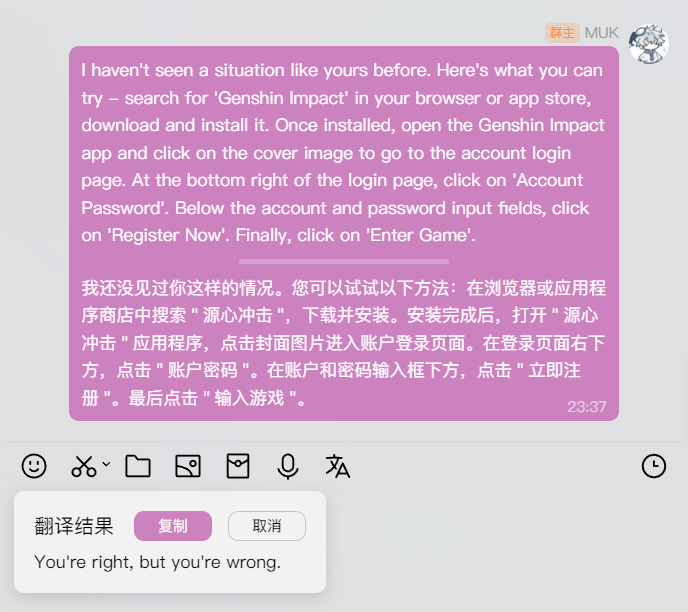

# LiteLoaderQQNT-DeepL

[简体中文](./README.md) | English

A [LiteLoaderQQNT](https://github.com/LiteLoaderQQNT/LiteLoaderQQNT) plugin that integrates DeepL translation into your QQNT.

Currently, it supports **right-click translation** and **in-message box text translation**.

MUK's TG channel: [MUKAPP](https://t.me/MUKAPP_Personal)

> [!NOTE]  
> Starting from version 1.0.8, the minimum supported version of LiteLoaderQQNT is 1.0.0 (Beta). Versions 1.0.7 and below support versions below 1.0.0.

- [LiteLoaderQQNT-DeepL](#liteloaderqqnt-deepl)
  - [Target language codes](#target-language-codes)
  - [Screenshots](#screenshots)
  - [Installation Methods](#installation-methods)
    - [Viewing Plugin Lists](#viewing-plugin-lists)
    - [PluginInstaller](#plugininstaller)
    - [Manual Installation](#manual-installation)
  - [Star History](#star-history)

## Target language codes
Excerpted from the official DeepL documentation:
- AR - Arabic
- BG - Bulgarian
- CS - Czech
- DA - Danish
- DE - German
- EL - Greek
- EN - English (unspecified variant for backward compatibility; please select EN-GB or EN-US instead)
- EN-GB - English (British)
- EN-US - English (American)
- ES - Spanish
- ET - Estonian
- FI - Finnish
- FR - French
- HU - Hungarian
- ID - Indonesian
- IT - Italian
- JA - Japanese
- KO - Korean
- LT - Lithuanian
- LV - Latvian
- NB - Norwegian (Bokmål)
- NL - Dutch
- PL - Polish
- PT - Portuguese (unspecified variant for backward compatibility; please select PT-BR or PT-PT instead)
- PT-BR - Portuguese (Brazilian)
- PT-PT - Portuguese (all Portuguese varieties excluding Brazilian Portuguese)
- RO - Romanian
- RU - Russian
- SK - Slovak
- SL - Slovenian
- SV - Swedish
- TR - Turkish
- UK - Ukrainian
- ZH - Chinese (simplified)

## Screenshots

## Installation Methods

### Viewing Plugin Lists

Install the [Plugin List Viewer](https://github.com/ltxhhz/LL-plugin-list-viewer) plugin. Open the corresponding settings page, locate this plugin, and click **Install** - **Use Release Package**. After installation, restart.

### PluginInstaller

Install the [PluginInstaller](https://github.com/xinyihl/LiteLoaderQQNT-PluginInstaller) plugin. Open the corresponding settings page, and in the plugin installation input box, enter `https://raw.githubusercontent.com/MUKAPP/LiteLoaderQQNT-DeepL/main/manifest.json`, then click the OK button.\
Alternatively, you can also install the [Protocio](https://github.com/PRO-2684/protocio) plugin simultaneously, then click [this link](https://mukapp.github.io/LiteLoaderQQNT-DeepL/res/protocio-install.html) to directly invoke PluginInstaller to install the plugin.

### Manual Installation

Unzip the downloaded Zip file. Move the extracted folder to `LiteLoaderQQNT directory/plugins/`. Restart QQ to apply changes.\
(If after unzipping it's not a single folder but several folders and files, then please create a folder, put the extracted folders and files into it, and then move it to the aforementioned path.)

## Star History
<picture>
  <source
    media="(prefers-color-scheme: dark)"
    srcset="
      https://api.star-history.com/svg?repos=MUKAPP/LiteLoaderQQNT-DeepL&type=Date&theme=dark
    "
  />
  <source
    media="(prefers-color-scheme: light)"
    srcset="
      https://api.star-history.com/svg?repos=MUKAPP/LiteLoaderQQNT-DeepL&type=Date
    "
  />
  
</picture>